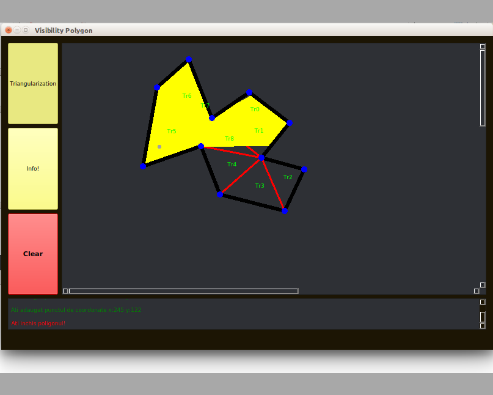

This is a project that I've made with <a href ="https://github.com/NeacsuRadu">Neacsu Radu</a>

Input: A polygon P, and A a point inside P.
Output: A graphical reprezentation oh the area inside P that is fisible from A.

The program uses Qt for GUI and I/O operations.

